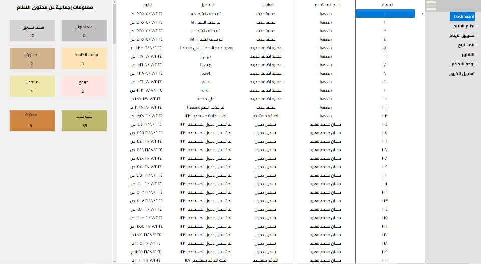
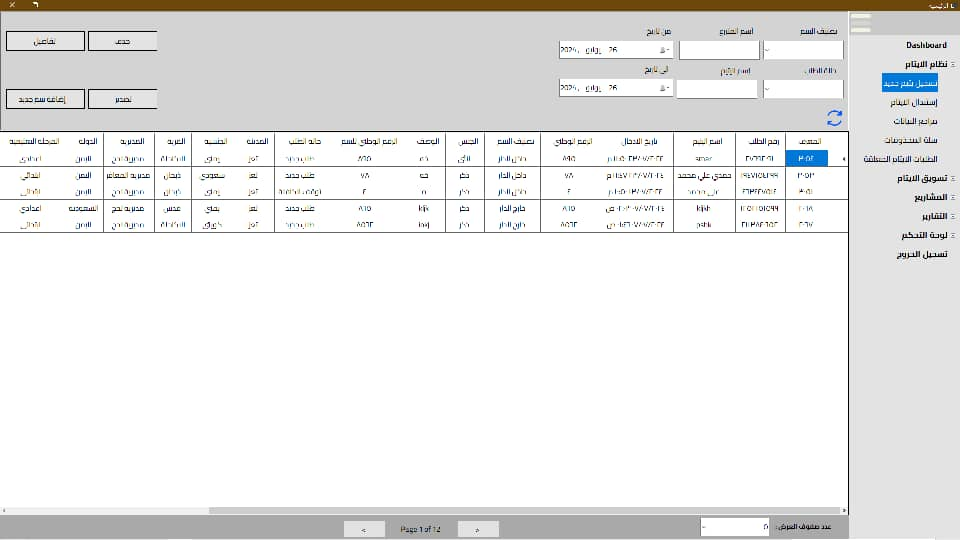
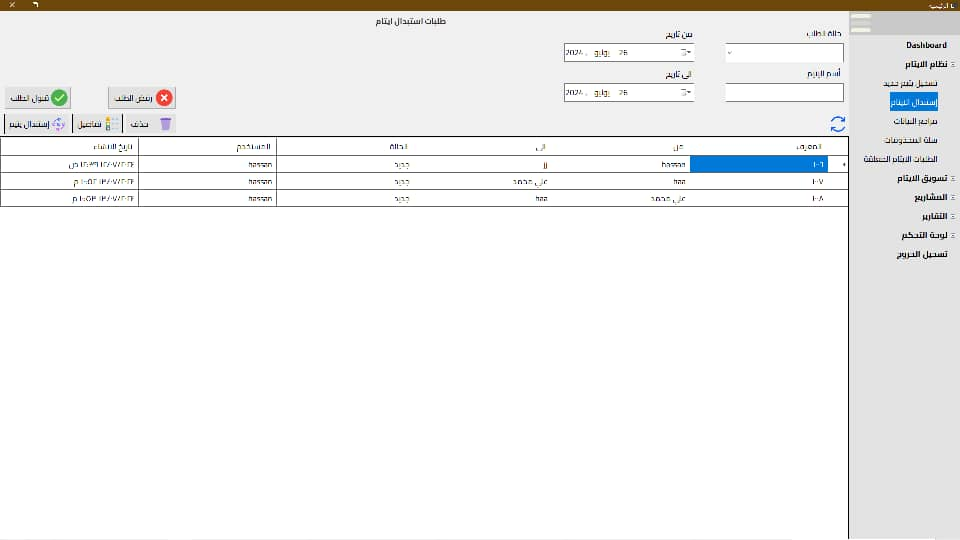
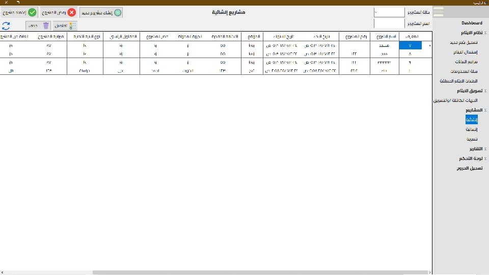
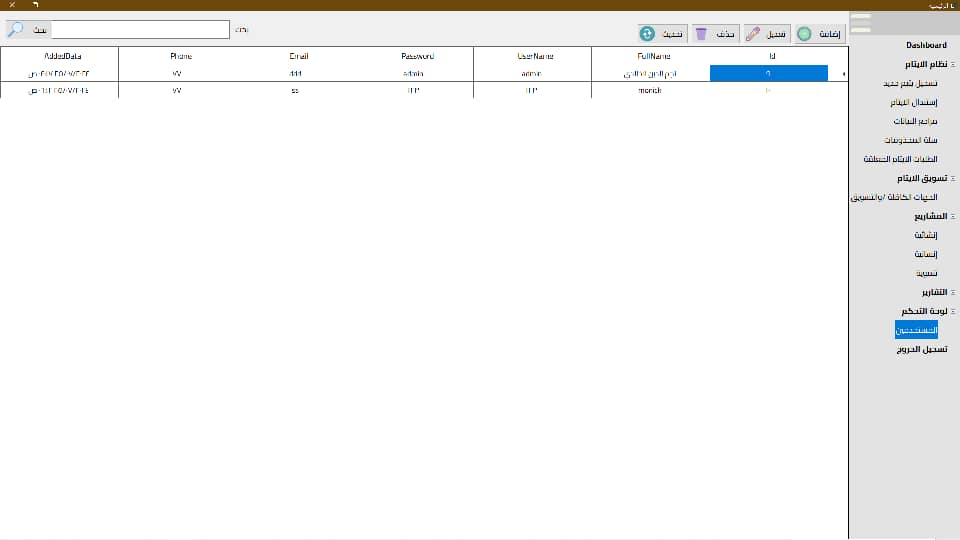

# 👨‍👩‍👧‍👦 Orphan Resource Management System

**A graduation project aimed at developing an integrated system to manage orphan data and charitable projects for a non-profit organization, using C#, Windows Forms, Entity Framework, and SQL Server.**

---

## 🧰 Technologies Used
- 💻 **Programming Language**: C#  
- 🧱 **User Interface**: Windows Forms  
- 🗃️ **Database**: SQL Server  
- 🔄 **ORM**: Entity Framework Core  
- 🧪 **Development Environment**: Visual Studio 2022  
- 📦 **.NET Core SDK**: 8.0.0  

---

## 🎯 Project Objectives
- Manage orphan data (personal, health, educational, and social information).
- Manage users and their permissions (Data Entry – Reviewer – System Admin).
- Track orphan statuses (New, Approved, Sponsored, Marketed...).
- Register charitable projects and link them to orphans.
- Restore or delete orphan data based on user roles.
- Generate various administrative and financial reports.

---

## 📷 System Screenshots  

---

---

---

---

---

---

---
## 🧑‍💻 User Roles & Permissions
| Role          | Allowed Actions                            |
|---------------|---------------------------------------------|
| Data Entry    | Add and edit orphan and project data        |
| Data Reviewer | Review, accept or reject data               |
| Admin         | Full access (manage users, reports, marketing, delete/restore...) |

---

## 🗃️ System Structure (Example Tables)
- `Orphans`: Stores basic orphan data.
- `Statuses`: Contains all possible orphan statuses.
- `Projects`: Details of charitable projects.
- `Users`: User information and permissions.
- `Sponsorships`: Sponsorship status of each orphan.

---

## ✅ Key Features
- Multi-level role-based access control.
- Track and switch orphan statuses according to defined logic.
- Ready-to-print detailed reports.
- User-friendly and responsive UI.
- Soft delete functionality for record recovery.

---

## 📌 Challenges Overcome
- Building complex table relationships using EF Core.
- Designing interactive forms using Windows Forms.
- Implementing status-swapping logic between orphans.
- Generating dynamic reports within the application.

---

## 📍 Future Enhancements
- Upgrade the UI using WPF or Blazor.
- Transform the system into a web or mobile app.
- Add multilingual support.

---

## 👤 Author
Developed by aInformation Technology graduate passionate about mobile and desktop application development.
